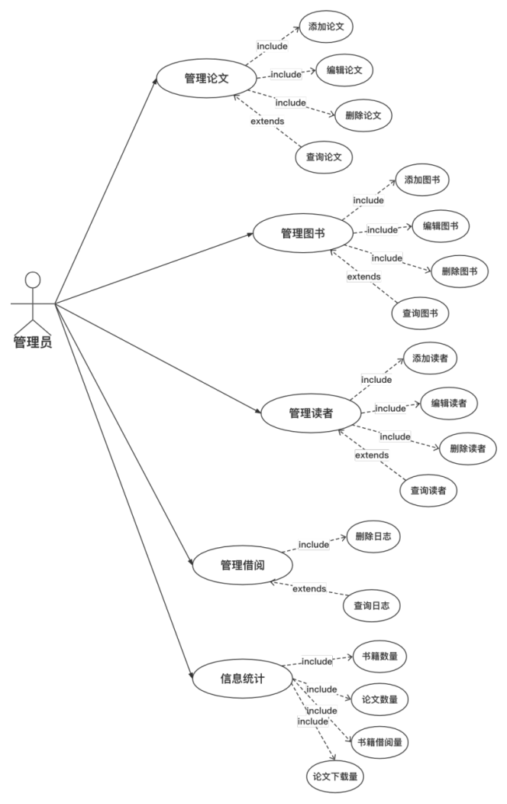
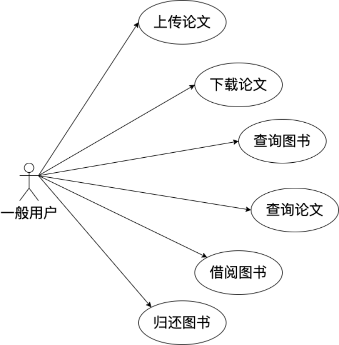
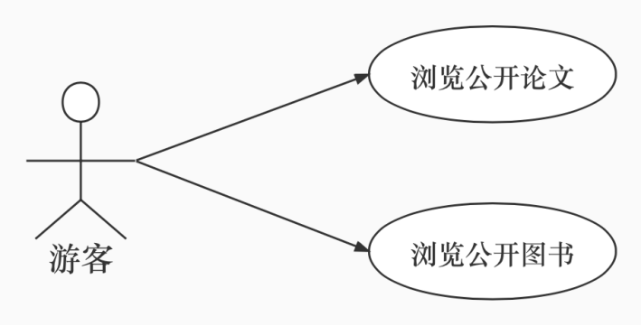

# WHU-MMS

## 简介

数据库大作业之资料管理系统（Materials Management System）。

资料类型：

- 图书
- 论文

## 功能

### 管理端

### 客户端

## 实验环境

- GUASSDB for MYSQL

## 前端

基于pyqt5的图形化用户界面。

## 后端

## 参考

https://www.huaweicloud.com/product/gaussdbformysql/getting-started.html

https://support.huaweicloud.com/gaussdb_faq/gaussdb_faq_0087.html

[我的毕业设计--图书管理系统 - 知乎 (zhihu.com)](https://zhuanlan.zhihu.com/p/191526813)

